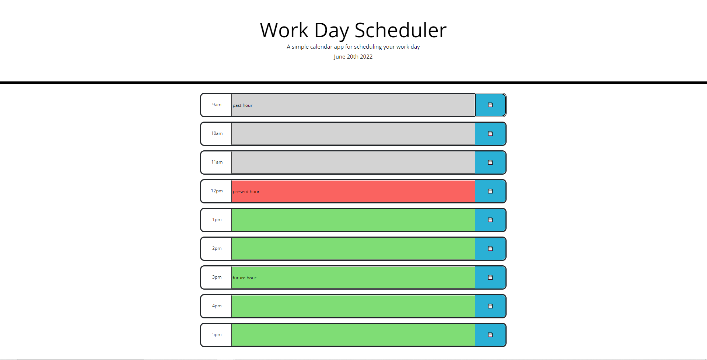

# Calendar

### This website has been built with the purpose of allowing a user to enter their daily plans for each hour and save them to local storage for future access. This allows user to access their daily plans at any time to improve user organization.
### This website is in its completed state with final commentation
### To use this website, simply click on a coloured row of any hour and type in your plans for that hour. Once plans have been typed in, click the blue save button 
### If an hours row background color is grey, the hour is in the past, if red, the hour is the current hour, if green, the hour is in the future.
### Please find URL here: https://ethangodley.github.io/Calendar/
### The website should look like the mockup included below

